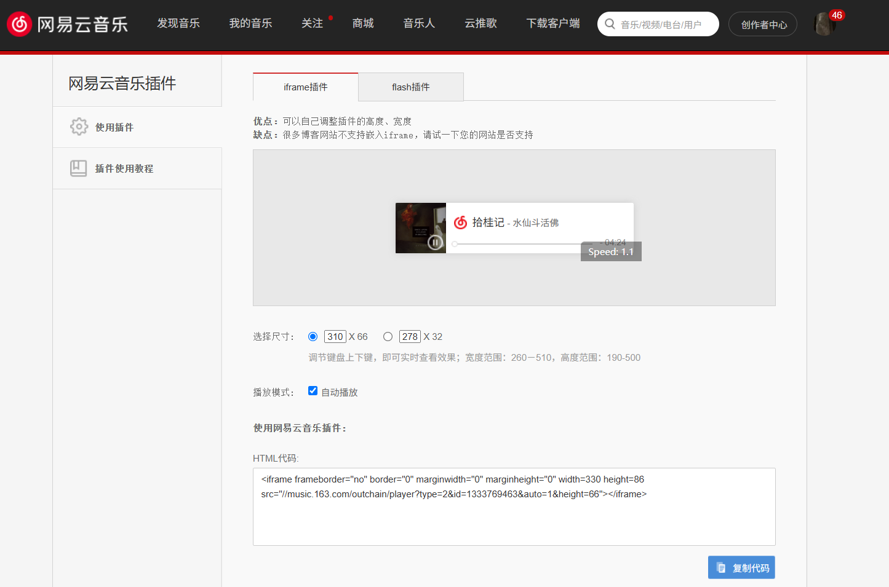

+ [hexo官网文档](https://hexo.io/zh-cn/docs/commands)
+ [icarus主题](https://ppoffice.github.io/hexo-theme-icarus/uncategorized/getting-started-with-icarus/)
+ [Next主题](https://theme-next.js.org/docs/theme-settings/)
+ 创建文章
```
Layout	filePath
post	source/_posts
page	source
draft	source/_drafts

hexo new [layout] "title" --path "path/to"  
```
+ 单独成页面
  在front-matter设置layout:false即可
  ```
    ---
    title: pointillism
    date: 2025-03-08 15:24:56
    layout: false
    ---
  ```
+ 添加网易云音乐
  直接使用网易云音乐外链（有些不行，看情况）
  
# next主题
## tag plugins
+ note
  ```
    
    
  ```
+ tab
  ```
    
    <!-- tab [Tab caption] [@icon] -->
    Any content (support inline tags too).
    <!-- endtab -->
    
  ```