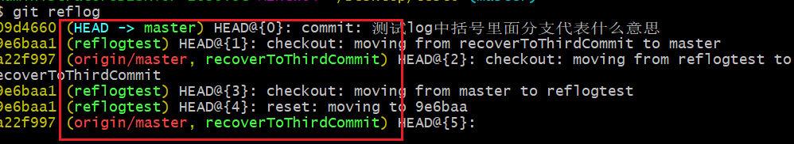
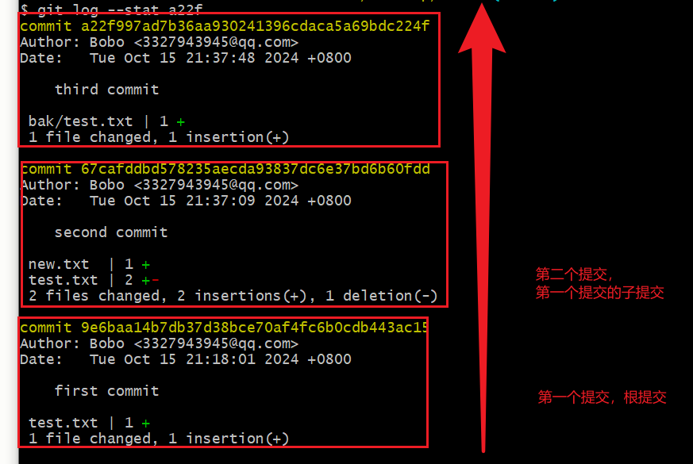
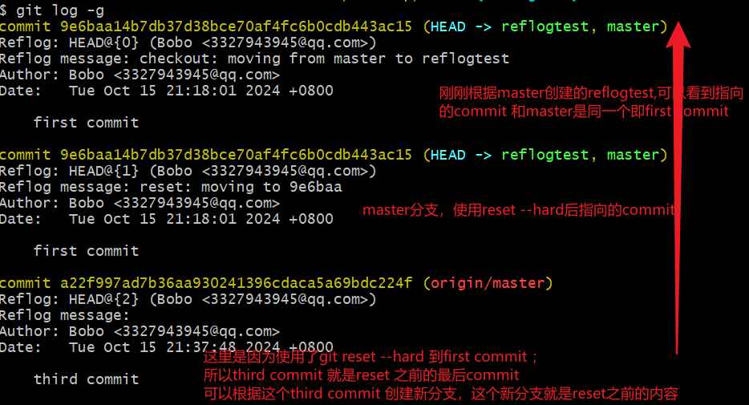

# [Git底层原理](https://git-scm.com/book/zh/v2/Git-%E5%86%85%E9%83%A8%E5%8E%9F%E7%90%86-Git-%E5%AF%B9%E8%B1%A1)
## git 日志
### git log /git log -g/git reflog 区别
1. 理解区别
**Question**

git reflog 和git log -g查看的是整个仓库的历史,git log 查看的是当亲分支的历史，这样理解对吗

**Answer**

您的理解是正确的。以下是对这几条命令的具体说明：

+  **`git log`**：这个命令用于查看当前分支的提交历史。它只会显示您当前所处分支的提交记录，不会涉及其他分支的历史。

+ **`git reflog`**：这个命令用于查看本地仓库的引用日志，它会显示最近的操作记录，包括提交、暂存、切换分支等。`reflog` 记录了所有操作的引用，实际上可以帮助您找到丢失的提交或撤销某些操作。

+ **`git log -g`**：这个命令是 `git log` 的一种扩展，可以查看引用的提交记录，包含所有的 refs（如分支和标签的移动历史）。它展示的数据不仅限于当前分支，而是涵盖了关于引用的更多信息，类似于 `reflog` 的内容。

总结来说：
- `git log` 关注于当前分支的历史。
- `git reflog` 关注于本地操作的历史。
- `git log -g` 则提供了对引用变动历史的一个全面视图。 

希望这能帮助您更好地理解这几个命令的区别！
2. 具体例子
+ 读log
  + 括号中有head的即当前活动所在commit对象
  + 括号中的分支即引用了这个commit的所有分支，当分支更新提交时就会随之变化，其实就是指明了对应的分支正在活动的commit对象处，切换分支时就是切换到这个commit
  + 括号中红色为远程分支，绿色是本地分支、
  + HEAD@{number}是commit 的别名，可以使用reset head~number的形式回退
  + “:”后的内容说明了做了什么操作来到这个commit
  
+ git log 查看当前分支日志

+ git reflog 查看

+ git log -g 查看包括reflog 的日志

